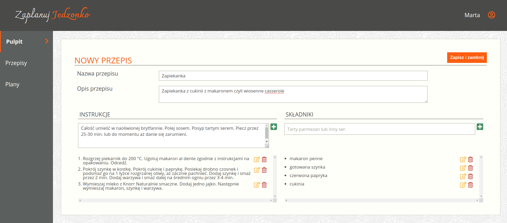

# Zaplanuj jedzonko
## Meal Planner App

Landing page with meal planner app. 
Application which helps users plan their meals weekly. 
This app uses localStorage of user browser to store all data. 
Work on the first part of this project was based on 
**Scrum methodology**.

### App functions:

- saving all data in localStorage
- add new recipes with description, instructions and ingredients
- possibility to edit or delete instruction/ingredient 
- view how many recipes and plans is currently being stored

### App functions in progress:

- add meal plans based on added recipes 
- switch between plans
- display all recipes or plans
- edit or remove plan or recipe

### Technologies:

- HTML5
- Sass
- JavaScript
- Gulp
- jQuery
- Git branches
- Node.js
- localStorage

### Landing Page Demo:

### Adding recipe Demo:

- log in
- add recipe name and description
- edit ingredients/instructions
- delete ingredients/instructions
- log out

### Screen view:

- adding a new recipe:

- recipes review:

### Installation:

- #### clone the repository
  `git clone https://github.com/mfuks/Meal_planner_App.git`
- #### install all dependencies
  `npm install`
- #### start
  `npm start`
  

