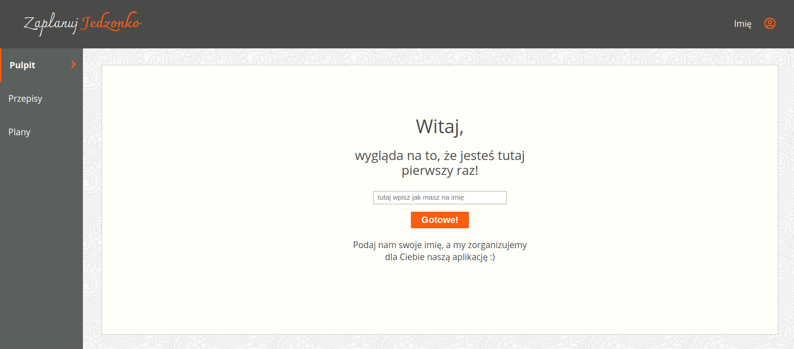
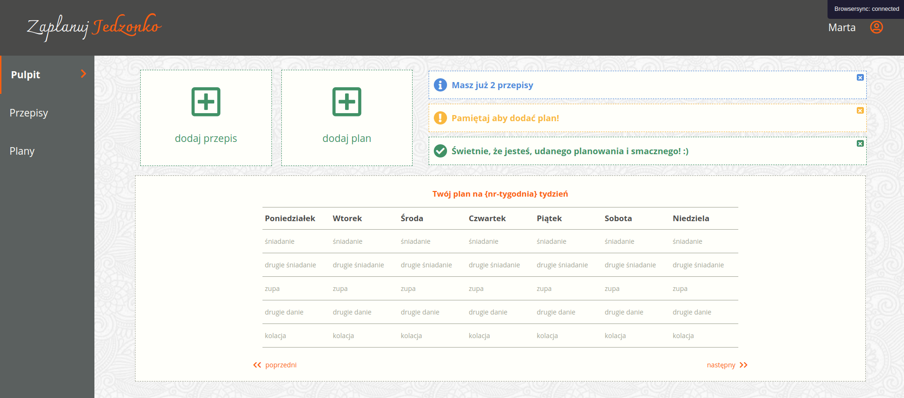

# Zaplanuj jedzonko
## Meal Planner App

Landing page with meal planner app. 
Application which helps users plan their meals weekly. This app uses localStorage of user browser to store all data. Work on the first part of this project was based on **Scrum methodology**

### App functions:

- add new recipes with description, instructions and ingredients
- add meal plans based on added recipes 

### App functions in progress:

- switch between plans
- display all recipes or plans
- edit or remove plan or recipe
- view how many recipes and plans is currently being stored

### Technologies:

- HTML5
- Sass
- JavaScript
- Gulp
- jQuery
- Git branches
- Node.js

### Landing Page Demo:

### Screen view:

- first visit form:

- app main view:

- adding new recipe:

- recipes review:

### Installation:

- #### clone the repository
  `git clone https://github.com/mfuks/Meal_planner_App.git`
- #### install all dependencies
  `npm install`
- #### start
  `npm start`
  

